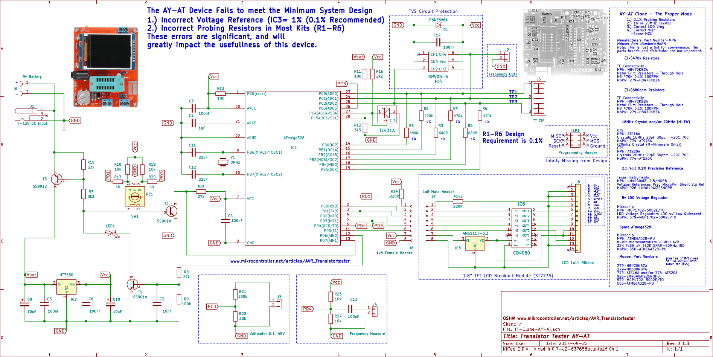

# ComponentTesterESP32S3

Component tester universale ispirato ai progetti GM328/Ho-Ro, portato su piattaforma ESP32-S3.  
Universal component tester inspired by the GM328/Ho-Ro projects, ported to ESP32-S3.

---

## 🇮🇹 Descrizione

**ComponentTesterESP32S3** è un progetto open-source per la realizzazione di un tester universale di componenti elettronici (bipolari, MOSFET, IGBT, SCR, Triac, PUT, UJT, LED, Zener, quarzi, OneWire...) controllato da ESP32S3, con display grafico, step-up integrato e logica di test evoluta.

### Caratteristiche principali
- Supporta: resistori, condensatori, diodi, Zener, LED (tutti i colori), transistor BJT/PnP/NPN, MOSFET, IGBT, SCR, Triac, PUT, UJT, quarzi, dispositivi OneWire e altro.
- Riconoscimento automatico del componente e del pinout.
- Misura parametri chiave (Vf, Vz, hFE, C, ESR, ecc.).
- Gestione di uno step-up tramite GPIO per test Zener/LED ad alta tensione (fino a 35V).
- Interfaccia utente su display grafico (con icone).
- Progetto pensato per hardware DIY o PCB dedicato (vedi PNG allegato).

### Come funziona
1. **Collega il componente ai 3 Test Point (TP1, TP2, TP3)**.
2. **Premi il pulsante di test**.
3. **Il firmware identifica automaticamente il tipo di componente, misura i parametri e mostra il risultato a display**.

### Schema e wiring
- Vedi immagine `AY-AT-J1.3.png` per il cablaggio consigliato.
- Step-up: controllato via una GPIO per abilitare tensione alta solo durante i test Zener/LED.
- Display: collegamento I2C/SPI (configurabile in `config.h`).

---

## 🇬🇧 Description

**ComponentTesterESP32S3** is an open-source project for a universal electronic component tester (bipolar transistors, MOSFETs, IGBTs, SCRs, Triacs, PUTs, UJTs, LEDs, Zener diodes, crystals, OneWire devices...), powered by ESP32S3, with graphical display, integrated step-up, and advanced detection logic.

### Key features
- Supports: resistors, capacitors, diodes, Zener, LEDs (all colors), BJT/PnP/NPN, MOSFETs, IGBTs, SCRs, Triacs, PUTs, UJTs, crystals, OneWire, and more.
- Automatic component and pinout detection.
- Measures key parameters (Vf, Vz, hFE, C, ESR, etc).
- Step-up management via GPIO for high-voltage Zener/LED tests (up to 35V).
- User interface on graphic display (with icons).
- Designed for DIY hardware or custom PCBs (see included PNG).

### How it works
1. **Connect the component to the 3 Test Points (TP1, TP2, TP3)**.
2. **Press the test button**.
3. **Firmware automatically detects the component type, measures parameters, and displays the result**.

### Schematic and wiring
- See image `AY-AT-J1.3.png` for suggested wiring.
- Step-up: controlled by a GPIO, enabled only during Zener/LED tests.
- Display: I2C/SPI connection (configurable in `config.h`).

---

## 🚀 Avvio rapido / Quick Start

### 🇮🇹
1. **Clona la repo**
    ```sh
    git clone https://github.com/Caluk55/ComponentTesterESP32S3.git
    ```
2. **Apri `ComponentTesterESP32S3.ino` con Arduino IDE o PlatformIO**
3. **Configura i pin in `config.h` secondo il tuo hardware**
4. **Carica su ESP32-S3**
5. **Collega e testa i componenti!**

### 🇬🇧
1. **Clone the repo**
    ```sh
    git clone https://github.com/Caluk55/ComponentTesterESP32S3.git
    ```
2. **Open `ComponentTesterESP32S3.ino` in Arduino IDE or PlatformIO**
3. **Set the pins in `config.h` for your hardware**
4. **Upload to your ESP32-S3**
5. **Connect and test your components!**

---

## 🛠️ File principali / Main files

- `ComponentTesterESP32S3.ino` – Entry point (setup e loop principali / main firmware loop)
- `test.cpp/.h` – Logica di rilevamento componenti e test avanzati / main testing logic
- `tp.cpp/.h` – Gestione dei Test Point / Test Point management
- `adc.cpp/.h` – Letture ADC / ADC readings
- `display.cpp/.h`, `icons.h` – Gestione display grafico e icone / display and icons
- `config.h` – Configurazione pin, step-up, display / configuration

---

## 💡 Note pratiche / Practical notes

- **Step-up**: la corrente di test è limitata da resistenze per non danneggiare Zener/LED.
- **Display**: compatibile con vari modelli, serve impostare il tipo in `config.h`.
- **Pinout**: personalizzabile, vedi commenti in `config.h`.
- **Nuovi componenti**: puoi aggiungere facilmente nuove routine in `test.cpp`.

---

## 📝 Licenza / License

**Licenza libera.**  
Chiunque può utilizzare, modificare e condividere il codice per qualsiasi scopo, preferibilmente citando l'autore e mantenendo i ringraziamenti agli autori originali (vedi sezione "Credits & ringraziamenti").  
No formal restrictions: anyone can use, modify and share this code for any purpose, preferably with credits to the author and keeping original acknowledgements (see "Credits & ringraziamenti").

---

## 📷 Esempi / Examples



---

## 🙏 Credits & ringraziamenti / Acknowledgements

- Basato su GM328, Ho-Ro, AY-AT, e altri tester open-source.
- Un ringraziamento speciale a **Ho-Ro** per il lavoro pionieristico e la condivisione della conoscenza nei forum internazionali, fonte di ispirazione e base tecnica per moltissime evoluzioni di tester universali.
- Thanks to [Karl-Heinz Kübbeler](https://www.mikrocontroller.net/articles/AVR_Transistortester), Ho-Ro, and the open-source community for inspiration and reference designs!

---

## 📬 Contributi / Contributions

Pull request, segnalazioni bug, e suggerimenti sono benvenuti!  
PRs, bug reports, and suggestions are welcome!
